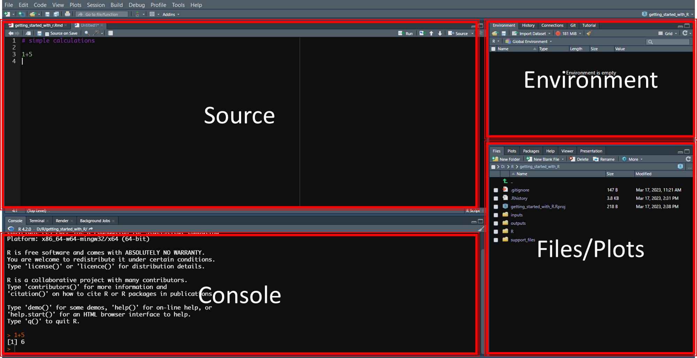
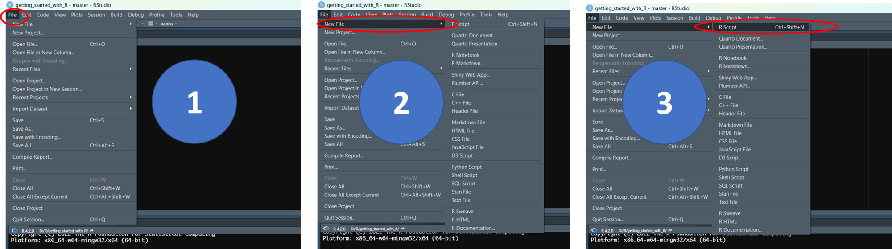

```{r setup, include=FALSE}
knitr::opts_chunk$set(echo = TRUE, warning = F, message = F)
```

# {.tabset}

## Setting up the environment

### why R

R is a scripting language known for its simple syntax.
It is suitable for anyone desiring start or enhance their journey in
data management, analysis and scientific research. It can be used to
retrieve data, clean, analyse and visualize the data.

- Simple syntax
- Variety of packages to handle wide range of tasks
- Powerful RStudio IDE for simplify code management and getting started
- Also R has a large community of users and you will easily get support

### Installing R and RStudio

Before we start coding, we need to setup the coding environment. 
We shall install R and RStudio the graphical Integrated Development Environment (**IDE**) for R.
RStudio makes using R much easier and more interactive.

### Installing R

**[Download the R installation file](https://cran.r-project.org/bin/windows/base/)**.

Run the downloaded file and accept prompts to install.

**[Download the RStudio installation file](https://posit.co/download/rstudio-desktop/)**.

Run the downloaded file and accept prompts as well.

### RStudio Interface

RStudio is divided into 4 panels

- Source (top-left)
- R Console (top-right)
- Environment/History (top-right)
- Files/Plots/Packages/Help/Viewer (bottom-right)



### Interacting with RStudio

#### a) Using the RStudio console

We can use RStudio console to give commands to R on what it should do.

write the line below in the console and hit enter

```{r}
print("Hello world")
```

simple calculations

```{r}
1 + 5
```

#### b) Creating script files

We can create new scripts and put our commands that R should perform.

Follow the steps shown in the figure to create a new file.


Let us now add the previous code into the script and save the script.

```{r}
print("Hello world")

# This is a comment
# simple calculations
1 + 5
```

### Variable assignment

We use **`<-`** symbol to assign objects to variables. 

This symbol has the followig shortcut on windows computers **`alt + -`**

```{r}
# assigning
greeting <- "Hello"

print(greeting)

# joining strings
my_name <- "John"
greeting_2 <- paste(greeting, ":", my_name)

print(greeting_2)

```


## Functions

### What is a function

A function is a block of code that performs a specific task when instructed or called to do the task.

Programming languages have built in functions and developers can also create their own functions to perform desired tasks.

We have already used functions like **`print()`** to output some contents given and the **`paste()`** function to concatenate/join strings. These are built in function that we can use to perform the tasks for which they were created.

### creating functions

Apart from using the built in functions, we can also create new functions to easily perform tasks. 
This could be trying to reduce on duplicating code for repetitive tasks or 
as away to share code with others through functions.

To define a function, we use the **`function`** keyword. The function may have or may not have arguments

The function syntax can take on the format below:
```{r }

function_name <- function(argument_1, argument_2, ...){
  function_body
}
```

- **function_name**. The name of the function
- **arguments**. The function may have several arguments/inputs depending on the needs. These could be data of different types. 
- **function_body**. This is where we put instructions using code to perform different tasks.

#### Examples creating functions

```{r}
# a function to join entered names
my_fullname <- function(first_name, last_name) {
  combined_name <- paste("My name is: ", 
                         first_name, 
                         toupper(last_name))
  print(combined_name)
}

# a function to multiply arguments
my_multiplication <- function(first_num = 10, second_num = 6) {
  multiply_arguments <- first_num * second_num
  my_result <- paste("My result is: ", multiply_arguments)
  print(my_result)
}
```

#### Calling functions

We call functions by giving their names and supplying arguments in case they are required by the functions.
Let us use examples from the functions we have created.

```{r}
# call my_fullname function
my_fullname(first_name = "John", last_name = "Peter")

# call my_multiplication function
my_multiplication() # uses default values of the arguments
my_multiplication(first_num = 125, second_num = 61) # uses supplied values to arguments

```

#### Getting help on functions

If functions have documentation, lieke inbuilt function and functions from other created packages,
we can access their documentation using the **`help()`** function or **`?`** symbol to access the documentation of the functions and how these functions can be used.

```{r}
# using help()
help("paste")
help(paste)

# using ?
?"paste"
?paste
```


## Data types and structures

### Data types

Variables can store data of different data types.
In R, the data type of the R-object becomes the data type of the variable.

- **numeric** - (6.5, 71, 217)
- **integer** - (1L, 33L, 301L, "L" declares this as an integer)
- **complex** - (9 + 3i, where "i" is the imaginary part)
- **character (a.k.a. string)**  - ("m",  "TRUE", "Getting started with R", "FALSE", "23.1")
- **logical (a.k.a. boolean)**  - (TRUE or FALSE)

The **`class()`** function is used to check the data type of a variable

```{r}
greeting <- "Hello"
class(greeting)

my_data <- c("m",  "TRUE", "Getting started with R", "FALSE", "23.1")

class(my_data)
```


### Vectors

A vector is a common data type in R and is composed of a series of values that are of the same data type. Either numbers or characters or logical.

We create a vector using the **`c()`** function and seperate the items using a comma.

```{r}
# Create a vector.
fisher_men <- c("Peter", "Andrew", "James", "John") # character vector
print(fisher_men)

# Get the class of our vector.
print(class(fisher_men))

vector_num <- c(11, 101, 23, 50.3) # numeric vector 
class_vec_num <- class(vector_num)

vector_log <- c(TRUE, FALSE, FALSE, TRUE) # logical vector
class_vec_log <- class(vector_log)

print(paste("The class of vector_num is: ", class_vec_num))
print(paste("The class of vector_log is: ", class_vec_log))

```

#### Subsetting vectors

To access elements of a vector, we use indices. The index of the first element in a vector is **1**, the second is **2** ...

We provide the index in square brackets to retrieve the desired element from the vector.

```{r}

fisher_men <- c("Peter", "Andrew", "James", "John") # character vector

# first element
fisher_men[1]

# last element
fisher_men[length(fisher_men)]

# particular elements
fisher_men[fisher_men %in% c("John", "Andrew")]

vector_num <- c(11, 101, 23, 50.3) # numeric vector 

# first element
vector_num[1]

# last element
vector_num[length(vector_num)]

# particular elements
vector_num[vector_num > 15]

```

#### Repeat vectors

Repeat vectors using the **`rep()`** function

```{r}
# each
rep(c("Peter", "Andrew", "James", "John"), each = 5)

# times
rep(c("Peter", "Andrew", "James", "John"), times = 5)

rep(c("Peter", "Andrew", "James", "John"), times = c(4, 2, 3, 1))

```

#### Sequenced vectors
Use the **`:`** symbol or **`seq()`** function to create a vector of sequencies.
```{r}
# using ':'
1:20

# using 'seq()'
seq(from = 1, to = 20, by = 1)

seq(from = 1, to = 20, by = 4)

seq(from = 1, to = 100, by = 5)

```


### lists

A list can contain objects of different data types (mixture of numeric, character, logical ...)

We use the **`list()`** function to create a list.

```{r}
fisher_men <- c("Peter", "Andrew", "James", "John") # character vector

vector_num <- c(11, 101, 23, 50.3) # numeric vector 

vector_log <- c(TRUE, FALSE, FALSE, TRUE, FALSE)

my_list <- list(fisher_men, vector_num, vector_log)

# access elements of a list
my_list[[1]]
my_list[[length(my_list)]]

# named list elements
my_list <- list("first_elem" = fisher_men, 
                "second_elem" = vector_num, 
                "third_elem" = vector_log)

my_list$first_elem
my_list$second_elem

# Get the type of an object using the typeof() function
typeof(my_list)

# Get the length of the list using the length() function
length(my_list)

# last element of a list
my_list[[length(my_list)]]

```


### Data Frames

Data frames are tabular data objects. They can store data in columns of different data types.
Some can be `character` columns, others `numeric` and others `logical`. A data frame is a two dimensional object and stores lists of vectors of the same length.

A data frame is the most common way of storing tabular (table or spreadsheet) data and is something you will work with often.

We use the function **`data.frame()`** to create a data frame.

```{r }
my_dataframe <- data.frame(
  id = 1:4,
  name = c("Peter", "Andrew", "James", "John"),
  height=c(1.65, 1.61, 1.72, 1.55)
)
```
We can check the structure of the data frame using the **`str()`** function

```{r}
str(my_dataframe)
```


## Useful functions for data mgt

reading and writing files,
select,
mutate, 
filter, 
group_by,
summarise

```{r }

```

## Creating reports in R


```{r }

```
