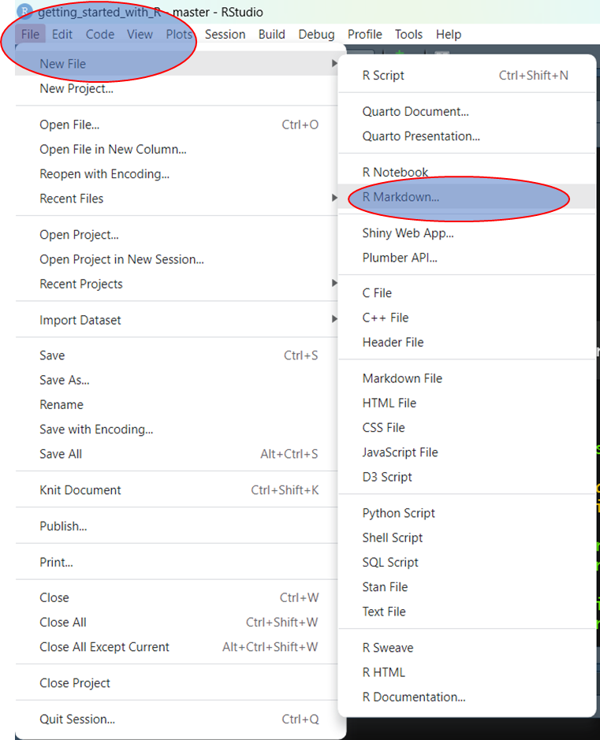
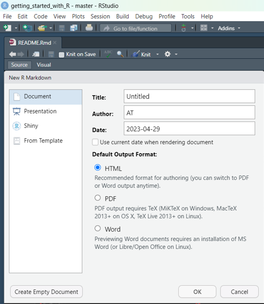
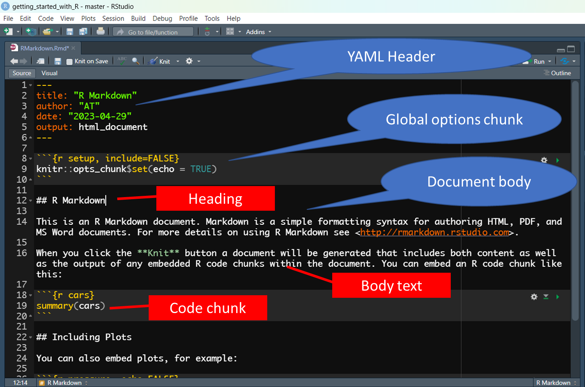
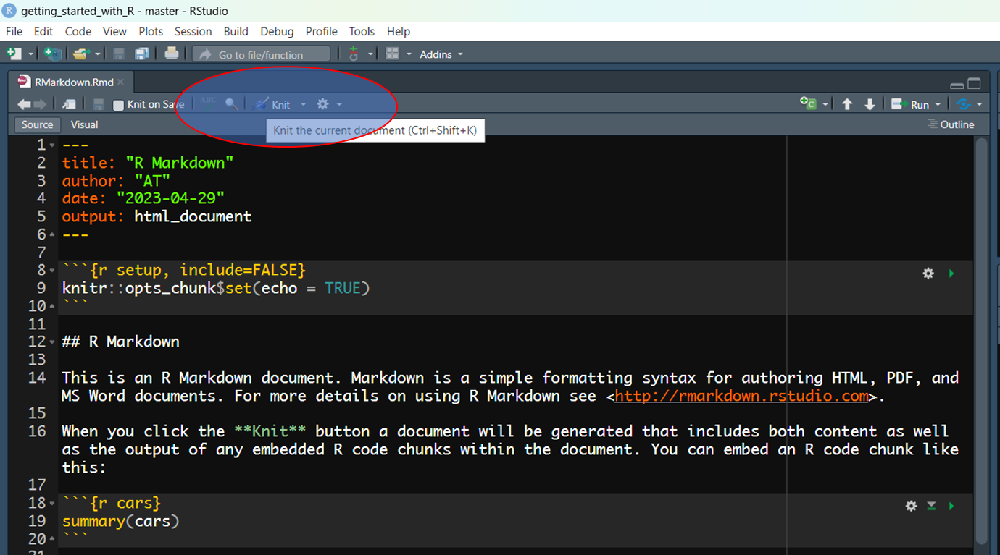

```{r setup, include=FALSE}
knitr::opts_chunk$set(eval = FALSE, echo = TRUE, warning = F, message = F, results = "hide")
```

# Getting started with R Markdown

R Markdown helps us to generate reports. The reports could be based on changing data like during data collection where you have to communicate daily data collection progress to different teams. It could also be a dynamic report generated regularly after a given period of time like weekly or monthly report. when we connect these reports with data, it becomes easy for us to run the code and generate these reports.

These reports can include different elements like text, tables, graphs, maps e.t.c that are based on the data that we are reporting on. 

The reports can be generated in different formats like HTML files, PDF files, Word files, Presentation files ...

## Creating and an R Markdown file

You can create `R Markdown` files the same way we create `R` files. From the `File` menu, click `New File` then `R Markdown…`





From the pop up pane, choose the format of the report to generate give the Title of the document and click OK.





It will create a file with sample content containing basic parts of the report.

Save the file into an appropriate folder for our case the `R` folder in our project and start modifying or clear the sample content and add your own content.

## Basic parts of the file and syntax



## YAML header

This part controls the document type to create. In this header, you can specify the type of document, the author, the title and other properties like table of contents for the document if appropriate.

## Global options chuck

This part allows us to specify some options that affect the entire document. This could include code folding, evaluation, display of messages, how to handle results, if to include the chunk. These options can be overridden in the individual chunk options.

## Document body

In the body, we put content that will be seen in the report. The content may include headings, text, graphs, tables, maps, code e.t.c. 

## Headings

We use the **`#`** symbol to define the heading level

```{r headings}
# First-level header

## Second-level header

### Third-level header

```


## Body text

We write free text outside of chunks and this text will be generated in the report. We can also style this text by giving it colour, making it bold, italic.

>Normal text

>**Bold text** or __Another bold text__

>*Italic text* or _Another italic text_

><span style="color:red"> This is coloured text </span>

```{r body-text}
Normal text

**Bold text** or __Another bold text__

*Italic text* or _Another italic text_

<span style="color:red"> This is coloured text </span>
  
```

## Links

We can also add links to reports. Next is the link to our repository.

[Getting started with R](https://github.com/twesigye10/getting_started_with_R)

[Markdown Basics](https://rmarkdown.rstudio.com/authoring_basics.html)

```{r links}
[Getting started with R](https://github.com/twesigye10/getting_started_with_R)

[Markdown Basics](https://rmarkdown.rstudio.com/authoring_basics.html)
```


## Code chunks

Inside a code chunk, we can put R code that will be run and results added to the report. Code can also be added in text as inline code to return some results from the code. If your results are assigned to a variable, remember to call the variable after evaluation. This way, it will show the output.

```{r iris}
summary(iris)
```

Inline code. The number of observations for iris data is: **`r nrow(iris)`**

```{r}
Inline code. The number of observations for iris data is: **`r nrow(iris)`**
```


## Generate the report

You generate the report by knitting the document using the knit button on top of the document. Or you can use the keyboard shortcut of **`Ctrl + Shift + K`**.



## Useful keyboard shortcuts on windows

- **`Ctrl + Alt + I`**. Used to create a new code chunk

- **`Ctrl + Shift + K`**. Used to knit the file

Note: This is a list

```{r}
- Ctrl + Alt + I. Used to create a new code chunk

- Ctrl + Shift + K. Used to knit the file
```

## Visualizing tables with DT

You can easily visualize tables with [`DT` package](https://rstudio.github.io/DT/) an interface to the JavaScript library  DataTables. This can be installed using the following code. An example of usage has also been included.

```{r tables}

install.packages("DT")

library(DT)

iris |> 
  datatable()

```

## Scatter plot

The scatter plot helps us to analyse the relationship between observations. It can be handy during Exploratory Data Analysis (EDA) to explore the data.

```{r graphs}

library(tidyverse)

df_iris <- read_csv("inputs/iris_data.csv")

# scatter with color categories
ggplot(data = df_iris, aes(x = Sepal.Length, y = Sepal.Width, colour = Species)) +
    geom_point() +
    labs(title = "Plot of Sepal measurements")
```


# Exercise 2

Transfer exercise 1 into R Markdown to generate HTML report.


