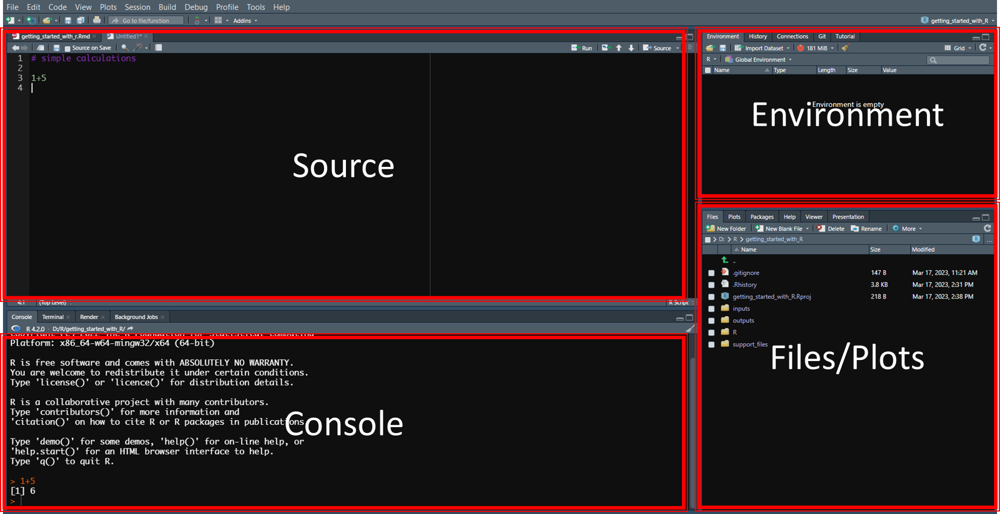
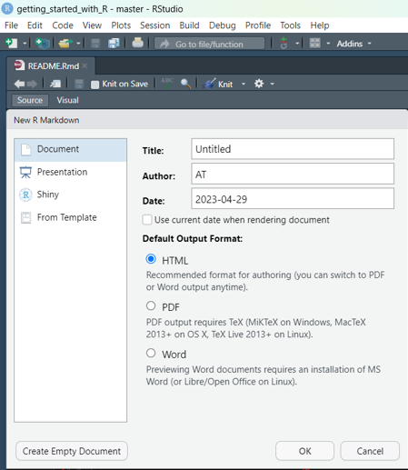
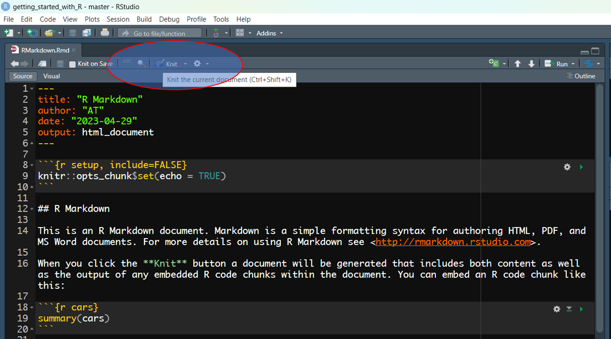

- <a href="#1-getting-started-with-r" id="toc-1-getting-started-with-r">1
  Getting started with R</a>
  - <a href="#11-why-r" id="toc-11-why-r">1.1 why R</a>
  - <a href="#12-setting-up-the-environment"
    id="toc-12-setting-up-the-environment">1.2 Setting up the
    environment</a>
  - <a href="#13-rstudio-interface" id="toc-13-rstudio-interface">1.3
    RStudio Interface</a>
  - <a href="#14-interacting-with-rstudio"
    id="toc-14-interacting-with-rstudio">1.4 Interacting with RStudio</a>
- <a href="#2-functions" id="toc-2-functions">2 Functions</a>
  - <a href="#21-what-is-a-function" id="toc-21-what-is-a-function">2.1 What
    is a function</a>
  - <a href="#22-creating-functions" id="toc-22-creating-functions">2.2
    creating functions</a>
- <a href="#3-data-types-and-structures"
  id="toc-3-data-types-and-structures">3 Data types and structures</a>
  - <a href="#31-data-types" id="toc-31-data-types">3.1 Data types</a>
  - <a href="#32-vectors" id="toc-32-vectors">3.2 Vectors</a>
  - <a href="#33-lists" id="toc-33-lists">3.3 lists</a>
  - <a href="#34-data-frames" id="toc-34-data-frames">3.4 Data Frames</a>
  - <a href="#35-practice-1" id="toc-35-practice-1">3.5 Practice 1</a>
  - <a href="#36-install-swirl" id="toc-36-install-swirl">3.6 Install
    swirl</a>
  - <a href="#37-start-swirl" id="toc-37-start-swirl">3.7 Start swirl</a>
  - <a href="#38-install-and-runcourse"
    id="toc-38-install-and-runcourse">3.8 Install and runcourse</a>
- <a href="#4-reading-and-manipulating-data"
  id="toc-4-reading-and-manipulating-data">4 Reading and manipulating
  data</a>
  - <a href="#41-extending-r-base-functionality"
    id="toc-41-extending-r-base-functionality">4.1 Extending R base
    functionality</a>
  - <a href="#42-what-are-packages" id="toc-42-what-are-packages">4.2 What
    are packages</a>
  - <a href="#43-package-installation" id="toc-43-package-installation">4.3
    Package installation</a>
  - <a href="#44-package-loading" id="toc-44-package-loading">4.4 Package
    loading</a>
- <a href="#5-reading-and-writing-files"
  id="toc-5-reading-and-writing-files">5 Reading and writing files</a>
- <a href="#6-manipulating-data" id="toc-6-manipulating-data">6
  Manipulating data</a>
  - <a href="#61-select" id="toc-61-select">6.1 select</a>
  - <a href="#62-filter" id="toc-62-filter">6.2 filter</a>
  - <a href="#63-mutate" id="toc-63-mutate">6.3 mutate</a>
  - <a href="#64-rename" id="toc-64-rename">6.4 rename</a>
  - <a href="#65-summarise" id="toc-65-summarise">6.5 summarise</a>
  - <a href="#66-pipes" id="toc-66-pipes">6.6 Pipes</a>
  - <a href="#67-export-results" id="toc-67-export-results">6.7 Export
    results</a>
  - <a href="#68-practice-2" id="toc-68-practice-2">6.8 Practice 2</a>
- <a href="#7-creating-graphs-using-ggplot2"
  id="toc-7-creating-graphs-using-ggplot2">7 Creating Graphs using
  ggplot2</a>
  - <a href="#71-basic-steps-for-creating-graphs"
    id="toc-71-basic-steps-for-creating-graphs">7.1 Basic steps for creating
    graphs</a>
  - <a href="#72-bar-graph" id="toc-72-bar-graph">7.2 Bar graph</a>
  - <a href="#73-scatter-plot" id="toc-73-scatter-plot">7.3 Scatter plot</a>
  - <a href="#74-boxplot" id="toc-74-boxplot">7.4 Boxplot</a>
  - <a href="#75-export-plots" id="toc-75-export-plots">7.5 Export plots</a>
  - <a href="#76-exercise-1" id="toc-76-exercise-1">7.6 Exercise 1</a>
- <a href="#8-getting-started-with-r-markdown"
  id="toc-8-getting-started-with-r-markdown">8 Getting started with R
  Markdown</a>
  - <a href="#81-creating-and-an-r-markdown-file"
    id="toc-81-creating-and-an-r-markdown-file">8.1 Creating and an R
    Markdown file</a>
  - <a href="#82-basic-parts-of-the-file-and-syntax"
    id="toc-82-basic-parts-of-the-file-and-syntax">8.2 Basic parts of the
    file and syntax</a>
  - <a href="#83-yaml-header" id="toc-83-yaml-header">8.3 YAML header</a>
  - <a href="#84-global-options-chuck" id="toc-84-global-options-chuck">8.4
    Global options chuck</a>
  - <a href="#85-document-body" id="toc-85-document-body">8.5 Document
    body</a>
  - <a href="#86-headings" id="toc-86-headings">8.6 Headings</a>
  - <a href="#87-body-text" id="toc-87-body-text">8.7 Body text</a>
  - <a href="#88-links" id="toc-88-links">8.8 Links</a>
  - <a href="#89-code-chunks" id="toc-89-code-chunks">8.9 Code chunks</a>
  - <a href="#810-generate-the-report" id="toc-810-generate-the-report">8.10
    Generate the report</a>
  - <a href="#811-useful-keyboard-shortcuts-on-windows"
    id="toc-811-useful-keyboard-shortcuts-on-windows">8.11 Useful keyboard
    shortcuts on windows</a>
  - <a href="#812-visualizing-tables-with-dt"
    id="toc-812-visualizing-tables-with-dt">8.12 Visualizing tables with
    DT</a>
  - <a href="#813-scatter-plot" id="toc-813-scatter-plot">8.13 Scatter
    plot</a>
  - <a href="#814-exercise-2" id="toc-814-exercise-2">8.14 Exercise 2</a>
- <a href="#9-version-control-with-git-github-sourcetree-and-rstudio"
  id="toc-9-version-control-with-git-github-sourcetree-and-rstudio">9
  Version control with Git, GitHub, Sourcetree and RStudio</a>
  - <a href="#91-git-github" id="toc-91-git-github">9.1 Git, GitHub</a>
  - <a href="#92-installing-git" id="toc-92-installing-git">9.2 Installing
    Git</a>
  - <a href="#93-accessing-github" id="toc-93-accessing-github">9.3
    Accessing GitHub</a>
  - <a href="#94-sourcetree" id="toc-94-sourcetree">9.4 Sourcetree</a>
  - <a href="#95-configure-sourcetree-and-github"
    id="toc-95-configure-sourcetree-and-github">9.5 Configure Sourcetree and
    Github</a>
  - <a href="#96-enable-version-control-in-r-studio"
    id="toc-96-enable-version-control-in-r-studio">9.6 Enable version
    control in R Studio</a>
  - <a href="#97-add-github-account-to-sourcetree"
    id="toc-97-add-github-account-to-sourcetree">9.7 Add GitHub account to
    Sourcetree</a>
  - <a href="#98-set-up-github-to-accept-communication-with-sourcetree"
    id="toc-98-set-up-github-to-accept-communication-with-sourcetree">9.8
    set up GitHub to accept communication with Sourcetree</a>
  - <a href="#99-create-repository-on-github"
    id="toc-99-create-repository-on-github">9.9 Create repository on
    GitHub.</a>
  - <a href="#910-create-a-new-r-studio-project"
    id="toc-910-create-a-new-r-studio-project">9.10 Create a new R Studio
    project.</a>
  - <a href="#911-add-the-r-studio-project-to-sourcetree"
    id="toc-911-add-the-r-studio-project-to-sourcetree">9.11 Add the R
    Studio project to Sourcetree</a>
  - <a href="#912-connect-r-studio-project-and-github-repository"
    id="toc-912-connect-r-studio-project-and-github-repository">9.12 Connect
    <code>R Studio Project</code> and <code>GitHub repository</code></a>
  - <a href="#913-main-git-operations-with-version-control-with-sourcetree"
    id="toc-913-main-git-operations-with-version-control-with-sourcetree">9.13
    Main Git operations with version control with Sourcetree</a>

<!-- README.md is generated from README.Rmd. Please edit that file -->
<!-- badges: start -->
<!-- badges: end -->

# 1 Getting started with R

## 1.1 why R

R is a scripting language known for its simple syntax. It is suitable
for anyone desiring start or enhance their journey in data management,
analysis and scientific research. It can be used to retrieve data,
clean, analyse and visualize the data.

- Simple syntax
- Variety of packages to handle wide range of tasks
- Powerful RStudio IDE for simplify code management and getting started
- Also R has a large community of users and you will easily get support

## 1.2 Setting up the environment

Before we start coding, we need to setup the coding environment. We
shall install R and RStudio the graphical Integrated Development
Environment (**IDE**) for R. RStudio makes using R much easier and more
interactive.

### 1.2.1 Installing R and RStudio

**[Download the R installation
file](https://cran.r-project.org/bin/windows/base/)**.

Run the downloaded file and accept prompts to install.

**[Download the RStudio installation
file](https://posit.co/download/rstudio-desktop/)**.

Run the downloaded file and accept prompts as well.

## 1.3 RStudio Interface

RStudio is divided into 4 panels

- Source (top-left)
- R Console (top-right)
- Environment/History (top-right)
- Files/Plots/Packages/Help/Viewer (bottom-right)



## 1.4 Interacting with RStudio

### 1.4.1 a) Using the RStudio console

We can use RStudio console to give commands to R on what it should do.

write the line below in the console and hit enter

``` r
print("Hello world")
```

simple calculations

``` r
1 + 5
```

### 1.4.2 b) Creating script files

We can create new scripts and put our commands that R should perform.

Follow the steps shown in the figure to create a new file.

 Let us now add the previous code into the script
and save the script.

``` r
print("Hello world")

# This is a comment
# simple calculations
1 + 5
```

### 1.4.3 Variable assignment

We use **`<-`** symbol to assign objects to variables.

This symbol has the followig shortcut on windows computers **`alt + -`**

``` r
# assigning
greeting <- "Hello"

print(greeting)

# joining strings
my_name <- "John"
greeting_2 <- paste(greeting, ":", my_name)

print(greeting_2)
```

# 2 Functions

## 2.1 What is a function

A function is a block of code that performs a specific task when
instructed or called to do the task.

Programming languages have built in functions and developers can also
create their own functions to perform desired tasks.

We have already used functions like **`print()`** to output some
contents given and the **`paste()`** function to concatenate/join
strings. These are built in function that we can use to perform the
tasks for which they were created.

## 2.2 creating functions

Apart from using the built in functions, we can also create new
functions to easily perform tasks. This could be trying to reduce on
duplicating code for repetitive tasks or as away to share code with
others through functions.

To define a function, we use the **`function`** keyword. The function
may have or may not have arguments

The function syntax can take on the format below:

``` r

function_name <- function(argument_1, argument_2, ...){
  function_body
}
```

- **function_name**. The name of the function
- **arguments**. The function may have several arguments/inputs
  depending on the needs. These could be data of different types.
- **function_body**. This is where we put instructions using code to
  perform different tasks.

### 2.2.1 Examples creating functions

``` r
# a function to join entered names
my_fullname <- function(first_name, last_name) {
  combined_name <- paste("My name is: ", 
                         first_name, 
                         toupper(last_name))
  combined_name
}

# a function to multiply arguments
my_multiplication <- function(first_num = 10, second_num = 6) {
  multiply_arguments <- first_num * second_num
  my_result <- paste("My result is: ", multiply_arguments)
  my_result
}
```

### 2.2.2 Calling functions

We call functions by giving their names and supplying arguments in case
they are required by the functions. Let us use examples from the
functions we have created.

``` r
# call my_fullname function
my_fullname(first_name = "John", last_name = "Peter")

# call my_multiplication function
my_multiplication() # uses default values of the arguments
my_multiplication(first_num = 125, second_num = 61) # uses supplied values to arguments
```

### 2.2.3 Getting help on functions

If functions have documentation, lieke inbuilt function and functions
from other created packages, we can access their documentation using the
**`help()`** function or **`?`** symbol to access the documentation of
the functions and how these functions can be used.

``` r
# using help()
help("paste")
help(paste)

# using ?
?"paste"
?paste
```

# 3 Data types and structures

## 3.1 Data types

Variables can store data of different data types. In R, the data type of
the R-object becomes the data type of the variable.

- **numeric** - (6.5, 71, 217)
- **integer** - (1L, 33L, 301L, “L” declares this as an integer)
- **complex** - (9 + 3i, where “i” is the imaginary part)
- **character (a.k.a. string)** - (“m”, “TRUE”, “Getting started with
  R”, “FALSE”, “23.1”)
- **logical (a.k.a. boolean)** - (TRUE or FALSE)

The **`class()`** function is used to check the data type of a variable

``` r
greeting <- "Hello"
class(greeting)

my_data <- c("m",  "TRUE", "Getting started with R", "FALSE", "23.1")

class(my_data)
```

## 3.2 Vectors

A vector is a common data type in R and is composed of a series of
values that are of the same data type. Either numbers or characters or
logical.

We create a vector using the **`c()`** function and seperate the items
using a comma.

``` r
# Create a vector.
fisher_men <- c("Peter", "Andrew", "James", "John") # character vector
print(fisher_men)

# Get the class of our vector.
print(class(fisher_men))

vector_num <- c(11, 101, 23, 50.3) # numeric vector 
class_vec_num <- class(vector_num)

vector_log <- c(TRUE, FALSE, FALSE, TRUE) # logical vector
class_vec_log <- class(vector_log)

print(paste("The class of vector_num is: ", class_vec_num))
print(paste("The class of vector_log is: ", class_vec_log))
```

### 3.2.1 Subsetting vectors

To access elements of a vector, we use indices. The index of the first
element in a vector is **1**, the second is **2** …

We provide the index in square brackets to retrieve the desired element
from the vector.

``` r

fisher_men <- c("Peter", "Andrew", "James", "John") # character vector

# first element
fisher_men[1]

# last element
fisher_men[length(fisher_men)]

# particular elements
fisher_men[fisher_men %in% c("John", "Andrew")]

vector_num <- c(11, 101, 23, 50.3) # numeric vector 

# first element
vector_num[1]

# last element
vector_num[length(vector_num)]

# particular elements
vector_num[vector_num > 15]
```

### 3.2.2 Repeat vectors

Repeat vectors using the **`rep()`** function

``` r
# each
rep(c("Peter", "Andrew", "James", "John"), each = 5)

# times
rep(c("Peter", "Andrew", "James", "John"), times = 5)

rep(c("Peter", "Andrew", "James", "John"), times = c(4, 2, 3, 1))
```

### 3.2.3 Sequenced vectors

Use the **`:`** symbol or **`seq()`** function to create a vector of
sequencies.

``` r
# using ':'
1:20

# using 'seq()'
seq(from = 1, to = 20, by = 1)

seq(from = 1, to = 20, by = 4)

seq(from = 1, to = 100, by = 5)
```

## 3.3 lists

A list can contain objects of different data types (mixture of numeric,
character, logical …)

We use the **`list()`** function to create a list.

``` r
fisher_men <- c("Peter", "Andrew", "James", "John") # character vector

vector_num <- c(11, 101, 23, 50.3) # numeric vector 

vector_log <- c(TRUE, FALSE, FALSE, TRUE, FALSE)

my_list <- list(fisher_men, vector_num, vector_log)

# access elements of a list
my_list[[1]]
my_list[[length(my_list)]]

# named list elements
my_list <- list("first_elem" = fisher_men, 
                "second_elem" = vector_num, 
                "third_elem" = vector_log)

my_list$first_elem
my_list$second_elem

# Get the type of an object using the typeof() function
typeof(my_list)

# Get the length of the list using the length() function
length(my_list)

# last element of a list
my_list[[length(my_list)]]
```

## 3.4 Data Frames

Data frames are tabular data objects. They can store data in columns of
different data types. Some can be `character` columns, others `numeric`
and others `logical`. A data frame is a two dimensional object and
stores lists of vectors of the same length.

A data frame is the most common way of storing tabular (table or
spreadsheet) data and is something you will work with often.

We use the function **`data.frame()`** to create a data frame.

``` r
my_dataframe <- data.frame(
  id = 1:4,
  name = c("Peter", "Andrew", "James", "John"),
  height=c(1.65, 1.61, 1.72, 1.55)
)
```

We can check the structure of the data frame using the **`str()`**
function

``` r
str(my_dataframe)
```

### 3.4.1 Access elements of the data frame

We can use the **`[, [[, $`** operators to access the elements of the
data frame.

``` r
# [
my_dataframe["name"]
# [[
my_dataframe[["name"]]
# $
my_dataframe$name
```

### 3.4.2 Number of rows and columns

we use **`dim()`** function to find the number of row and columns of a
data frame. We can also use the **`nrow()`** function to find the number
of rows and the **`ncol()`** function to find the number of columns of
the data frame.

``` r
# dimension of the data frame
dim(my_dataframe)

# number of rows
nrow(my_dataframe)

# number of columns
ncol(my_dataframe)
```

## 3.5 Practice 1

We are going to practice with swirl.
**[swirl](https://swirlstats.com/)** is an R package that consists of a
collection of interactive courses for learning R.

## 3.6 Install swirl

Use the following code to install the swirl package.

``` r
install.packages("swirl")
```

## 3.7 Start swirl

load the **`swirl`** package using the **`libray()`** function to load
the functions in the package.

``` r
library("swirl")
```

## 3.8 Install and runcourse

Use the **`install_course()`** function to install the
**`R_Programming_E`** course we shall be following for our first
practice.

``` r
install_course("R_Programming_E")
swirl()
```

Enjoy coding.

# 4 Reading and manipulating data

In order to manipulate data, we need to create, read/import data into
the R environment using appropriate functions. We can use functions
provided in the base system where applicable or functions in other
containers (packages) specialized for specific file types.

## 4.1 Extending R base functionality

## 4.2 What are packages

R comes with functionality in the base system. This functionality is
what you get when you download and install R. This can be extended using
containers (packages) that have other functionality or different
implementation. These packages contain functions to perform specific
tasks.

## 4.3 Package installation

For packages on The Comprehensive R Archive Network (CRAN), you can
install them using the **install.packages()** function, specifying the
name of the function in quotes. This can be done in the console pane
since we do not need to save this in a script.

> The code below will install all tidyverse related packages.
> **[tidyverse](https://www.tidyverse.org/)** is a group of packages
> designed with a similar philosophy, grammar, and data structures aimed
> at simplifying data management and analysis.

``` r
install.packages("tidyverse")
```

**NOTE** For packages under development by developers that may not be on
CRAN, we can install them using the **devtools** or **remotes**
packages. Let us install the **devtools** package with
**install.packages(“devtools”)**.

> We can now install a package using devtools

``` r
install.packages("devtools")

devtools::install_github("twesigye10/supporteR")
```

## 4.4 Package loading

We can load packages using the **library()** function.

``` r
library(tidyverse)
library(supporteR)
```

Before we start reading and writing files, let us add more sub folders
to our project.

We can use `supporteR` to easily create sub folders in our project using
the **`create_project_sub_folders()`** function. This will help us to
keep the folder names uniform as we walk the journey together. You can
write the following code in the console and hit enter.

``` r
supporteR::create_project_sub_folders()
```

# 5 Reading and writing files

We are going to use `iris` data that is included the `datasets` package.

We shall export this data into a `csv` for illustration purposes.

We can write a `csv` file using the the `write_csv()` function from the
same `readr` package. After exporting the data into the outputs folder,
copy it over into the inputs folder. This has been done to indicate that
we can always place the data we want to read/import into the `inputs`
folder and what ever we want to export into the `outputs` folder.

``` r
library(tidyverse)

# write_csv is a function inside readr package of tidyverse

write_csv(datasets::iris, file = "outputs/iris_data.csv")
```

We are now going to read in this data stored in the `inputs` folder of
the project.

``` r
library(tidyverse)

# read_csv is a function inside readr package of tidyverse
df_iris <- read_csv("inputs/iris_data.csv")
```

# 6 Manipulating data

## 6.1 select

We use the `select()` function from the `dplyr` package to subset
columns. That is to choose/remove columns of interest from the data
frame and work only with the desired columns.

With `iris` example we are going to select columns of interest by

``` r
library(tidyverse)

df_iris <- read_csv("inputs/iris_data.csv")

select(.data = df_iris, Species, Petal.Length)
select(.data = df_iris, c("Species", "Petal.Length"))

# another way. Using a pattern
select(.data = df_iris, starts_with("Sepal."))

select(.data = df_iris, ends_with(".Width"))
```

## 6.2 filter

We use the `filter()` function from the `dplyr` package to subset rows
of interest. This can be based on entries in one column or more columns.

``` r
library(tidyverse)

df_iris <- read_csv("inputs/iris_data.csv")

# considering one specific entry
filter(.data = df_iris, Species %in% c("versicolor"))
# considering two specific entry
filter(.data = df_iris, Species %in% c("versicolor", "virginica"))
# considering key word
filter(.data = df_iris, str_detect(string = Species, pattern = "versi"))

# considering more than one column
filter(.data = df_iris, Sepal.Length > 5, str_detect(string = Species, pattern = "versi"))
```

## 6.3 mutate

We can add columns to the data frame using the `mutate()` function from
`dplyr`package. This adds the new columns at the end of the data frame.

``` r
library(tidyverse)

df_iris <- read_csv("inputs/iris_data.csv")

mutate(.data = df_iris, sepal_length_category = ifelse(Sepal.Length > 6, "greater_than_6", "less_than_6"))

mutate(.data = df_iris, sepal_length_category = case_when(Sepal.Length < 5 ~ "cat_less_than_5",
                                                          Sepal.Length < 7 ~ "cat_5_6",
                                                          Sepal.Length >= 7 ~ "cat_7+"))
```

## 6.4 rename

We can use the `rename()` function to rename column names. We use the
format `new_name = old_name`

``` r
library(tidyverse)

df_iris <- read_csv("inputs/iris_data.csv")

rename(.data = df_iris, sepal_length = Sepal.Length)
```

Use the `rename_with()` function to rename multiple columns at once
following a certain pattern. We specify a function to do the renaming.

``` r
# convert all columns to upper case
rename_with(.data = df_iris, .fn = toupper)
# convert columns that start with "Petal" to lower case
rename_with(.data = df_iris, .fn = tolower, .cols = starts_with("Petal"))
```

## 6.5 summarise

Use the `summarise()` function to collapse the data frame into fewer
rows based on the summary you are creating. If no groups are present in
the data frame, the resulting data frame will be one row with the
summary.

``` r
library(tidyverse)

df_iris <- read_csv("inputs/iris_data.csv")

summarise(.data = df_iris, 
          mean_sepal_length = mean(Sepal.Length),
          mean_sepal_width = mean(Sepal.Width)
          )

# summarise based on grouping
df_iris_grp <- group_by(.data = df_iris, Species)

summarise(.data = df_iris_grp, 
          mean_sepal_length = mean(Sepal.Length),
          mean_sepal_width = mean(Sepal.Width)
          )
```

## 6.6 Pipes

Pipes help us to pipe/chain operations together. This way we could
combine renaming columns, filtering data and summarizing together. R
comes with the `|>` operator starting from R version 4.1.0. Before,
there was the `%>%` operator from `magrittr` package of `tidyverse`.

When using the pipes, the resulting data frame from the an operation is
the input data frame for the next operation.

``` r
library(tidyverse)

df_iris <- read_csv("inputs/iris_data.csv")

df_iris |> 
  filter(Species %in% c("versicolor", "virginica")) |> 
  mutate(sepal_length_category = case_when(Sepal.Length < 5 ~ "cat_less_than_5",
                                           Sepal.Length < 7 ~ "cat_5_6",
                                           Sepal.Length >= 7 ~ "cat_7+")) |> 
  rename_with(.fn = tolower, .cols = starts_with("Petal"))

# summarise
# group numbers
df_iris |> 
  group_by(Species) |> 
  summarise(count = n())
# mean
df_iris |> 
  group_by(Species) |> 
  summarise(mean_sepal_length = mean(Sepal.Length),
            mean_sepal_width = mean(Sepal.Width)
  )
```

## 6.7 Export results

We can export results the same way we exported the iris dataset. We can
create a variable and use it to export or we can still use pipes.

``` r

df_iris <- read_csv("inputs/iris_data.csv")

df_sep_measurements_mean <- df_iris |> 
  group_by(Species) |> 
  summarise(mean_sepal_length = mean(Sepal.Length),
            mean_sepal_width = mean(Sepal.Width)
  )

write_csv(df_sep_measurements_mean, "outputs/sep_measurements_mean.csv")
```

## 6.8 Practice 2

In the second practice, we are going to focus on using `dplyr` and
`tidyr` to clean data and make it tidy. We shall use the
**`Getting and Cleaning Data`** swirl course for this.

After course installation, you can run `swirl()` and select the course
you will have installed.

``` r
library("swirl")

install_course("Getting and Cleaning Data")

swirl()
```

Happy R coding days.

# 7 Creating Graphs using ggplot2

We can create graphs in R using different packages. For the purpose of
our learning, we shall use
**[ggplot2](https://ggplot2.tidyverse.org/reference/)** from tidyverse.
This package helps us to quickly create beautiful graphs using data in
the data frame and we can easily customize these graphs according to our
preference.

From the reference, you can click on the icons of desired graphs under
the `Geoms` sub heading to find more about the graph and how to create
it.

There is also another resource of **[R Graph
Gallery](https://r-graph-gallery.com/ggplot2-package.html)** on ggplot2
where you can access different graphs and explore how to create and
customize them.

ggplot graphs are built step by step, incrementing each step at the end
with a `+` sign.

## 7.1 Basic steps for creating graphs

- Attach data frame to the ggplot using the `data` argument
- Specify the mappings/aesthetics (`aes`). Columns and other properties
  to visualize
- Specify the type of plot/graph by adding the `geom_*()` functions.

## 7.2 Bar graph

We use the `geom_bar()` or `geom_col()` functions to create the bar
graphs. `geom_bar()` uses `stat_count()` by default and makes the height
of the bar proportional to the number of cases in each group.
`geom_col()` uses `stat_identity()` and the heights of the bars
represent values in the data.

``` r
library(tidyverse)

df_iris <- read_csv("inputs/iris_data.csv") |> 
  mutate(sepal_length_category = case_when(Sepal.Length < 5 ~ "cat_less_than_5",
                                                          Sepal.Length < 7 ~ "cat_5_6",
                                                          Sepal.Length >= 7 ~ "cat_7+"))

# basic geom_bar
ggplot(data = df_iris, aes(y = Species)) + # x or y column provided
  geom_bar(fill = "blue") + # uses stat_count() by default
  theme_bw()

# geom_bar color by category
ggplot(data = df_iris, aes(x = Species)) + # x or y column provided
  geom_bar(aes(fill = sepal_length_category)) + # uses stat_count() by default
  theme_bw()

# basic geom_col
ggplot(data = df_iris, aes(x = Sepal.Length, y = Species)) + # both x and y provided
  geom_col(fill = "blue") +  # uses stat_identity() by default
  theme_bw()

# geom_col color by category
ggplot(data = df_iris, aes(x = Sepal.Length, y = Species)) + # both x and y provided
  geom_col(aes(fill = sepal_length_category)) +  # uses stat_identity() by default
  theme_bw()

# summarizing data and plotting
df_mean_sep_len <- df_iris |> 
  select(Sepal.Length, Species) |> 
  group_by(Species) |> 
  summarise(`Mean Length` = mean(Sepal.Length))

# customizing the graph
ggplot(data = df_mean_sep_len, aes(x = `Mean Length`, y = Species)) +
  geom_col(fill = "blue") +
  theme_bw() +
  theme(axis.ticks = element_blank(),
        axis.text.x = element_text(face = "bold", size=12),
        axis.text.y = element_text(face = "bold", size=12),
        panel.grid.major.x = element_blank(),
        panel.grid.minor.x = element_blank(),
        panel.grid.minor.y = element_blank(),
        panel.border = element_blank(),
        axis.title = element_text(size=12)) +
  ylab(label = "")  
```

## 7.3 Scatter plot

The scatter plot helps us to analyse the relationship between
observations. It can be handy during Exploratory Data Analysis (EDA) to
explore the data.

``` r

library(tidyverse)

df_iris <- read_csv("inputs/iris_data.csv")

# Basic scatter
ggplot(data = df_iris, aes(x = Sepal.Length, y = Sepal.Width)) +
    geom_point() +
    labs(title = "Plot of Sepal measurements")

# scatter with color categories
ggplot(data = df_iris, aes(x = Sepal.Length, y = Sepal.Width, colour = Species)) +
    geom_point() +
    labs(title = "Plot of Sepal measurements")
```

## 7.4 Boxplot

The Boxplot can help us to check the distribution of the data

``` r
library(tidyverse)

df_iris <- read_csv("inputs/iris_data.csv")

# basic Boxplot
ggplot(data = df_iris, aes(x = Species, y = Sepal.Length)) +
    geom_boxplot()

# Boxplot with jitter
ggplot(data = df_iris, aes(x = Species, y = Sepal.Width, colour = Species)) +
    geom_boxplot() +
  geom_jitter()
```

## 7.5 Export plots

We can use ggsave to export graphs to use in presentations and reports.
It uses the defaults of the last plot displayed to export your plot.

``` r
ggsave("outputs/plot.png", scale = 2)
```

## 7.6 Exercise 1

> We are going to use the iris dataset to test our skills in working
> with data.

> 1)  Import the iris dataset into a variable named `df_iris`. For the
>     following steps, create a new variable `df_iris_data` assigning to
>     it the data you imported and use the pipe operator to add steps
>     `2` to `5`.
> 2)  Subset the dataset to keep with columns that start with `Petal`
>     and `Species`
> 3)  Rename columns that start with `Petal` by removing `Petal.` from
>     the columns. Maintaining only `Length` and `Width`
> 4)  Subset dataset to keep only rows where `Length` is greater than
>     `1.2`
> 5)  Create a new column of `Length_Category` with ranges `< 3`
>     “less_than_3”, `< 5` “btn_3\_and_5”, `> 5` “greater_than_5”
> 6)  Create a bar graph indicating the `Species` and colour the graph
>     based on `Length_Category`.
> 7)  Calculate the mean `Length` for each `Species` and store the
>     result in the `df_mean_length` variable.  
> 8)  Create a bar graph for the result from the previous step.
> 9)  Calculate the proportions based on `Species` and
>     `Length_Category`. Export this result into a csv file.

# 8 Getting started with R Markdown

R Markdown helps us to generate reports. The reports could be based on
changing data like during data collection where you have to communicate
daily data collection progress to different teams. It could also be a
dynamic report generated regularly after a given period of time like
weekly or monthly report. when we connect these reports with data, it
becomes easy for us to run the code and generate these reports.

These reports can include different elements like text, tables, graphs,
maps e.t.c that are based on the data that we are reporting on.

The reports can be generated in different formats like HTML files, PDF
files, Word files, Presentation files …

## 8.1 Creating and an R Markdown file

You can create `R Markdown` files the same way we create `R` files. From
the `File` menu, click `New File` then `R Markdown…`


From the pop up pane, choose the format of the report to generate give
the Title of the document and click OK.



It will create a file with sample content containing basic parts of the
report.

Save the file into an appropriate folder for our case the `R` folder in
our project and start modifying or clear the sample content and add your
own content.

## 8.2 Basic parts of the file and syntax


## 8.3 YAML header

This part controls the document type to create. In this header, you can
specify the type of document, the author, the title and other properties
like table of contents for the document if appropriate.

## 8.4 Global options chuck

This part allows us to specify some options that affect the entire
document. This could include code folding, evaluation, display of
messages, how to handle results, if to include the chunk. These options
can be overridden in the individual chunk options.

## 8.5 Document body

In the body, we put content that will be seen in the report. The content
may include headings, text, graphs, tables, maps, code e.t.c.

## 8.6 Headings

We use the **`#`** symbol to define the heading level

``` r
# First-level header

## Second-level header

### Third-level header
```

## 8.7 Body text

We write free text outside of chunks and this text will be generated in
the report. We can also style this text by giving it colour, making it
bold, italic.

> Normal text

> **Bold text** or **Another bold text**

> *Italic text* or *Another italic text*

> <span style="color:red">This is coloured text</span>

``` r
Normal text

**Bold text** or __Another bold text__

*Italic text* or _Another italic text_

<span style="color:red"> This is coloured text </span>
  
```

## 8.8 Links

We can also add links to reports. Next is the link to our repository.

[Getting started with
R](https://github.com/twesigye10/getting_started_with_R)

[Markdown Basics](https://rmarkdown.rstudio.com/authoring_basics.html)

``` r
[Getting started with R](https://github.com/twesigye10/getting_started_with_R)

[Markdown Basics](https://rmarkdown.rstudio.com/authoring_basics.html)
```

## 8.9 Code chunks

Inside a code chunk, we can put R code that will be run and results
added to the report. Code can also be added in text as inline code to
return some results from the code. If your results are assigned to a
variable, remember to call the variable after evaluation. This way, it
will show the output.

``` r
summary(iris)
```

Inline code. The number of observations for iris data is: **150**

``` r
Inline code. The number of observations for iris data is: **`r nrow(iris)`**
```

## 8.10 Generate the report

You generate the report by knitting the document using the knit button
on top of the document. Or you can use the keyboard shortcut of
**`Ctrl + Shift + K`**.



## 8.11 Useful keyboard shortcuts on windows

- **`Ctrl + Alt + I`**. Used to create a new code chunk

- **`Ctrl + Shift + K`**. Used to knit the file

Note: This is a list

``` r
- Ctrl + Alt + I. Used to create a new code chunk

- Ctrl + Shift + K. Used to knit the file
```

## 8.12 Visualizing tables with DT

You can easily visualize tables with [`DT`
package](https://rstudio.github.io/DT/) an interface to the JavaScript
library DataTables. This can be installed using the following code. An
example of usage has also been included.

``` r

install.packages("DT")

library(DT)

iris |> 
  datatable()
```

## 8.13 Scatter plot

The scatter plot helps us to analyse the relationship between
observations. It can be handy during Exploratory Data Analysis (EDA) to
explore the data.

``` r

library(tidyverse)

df_iris <- read_csv("inputs/iris_data.csv")

# scatter with color categories
ggplot(data = df_iris, aes(x = Sepal.Length, y = Sepal.Width, colour = Species)) +
    geom_point() +
    labs(title = "Plot of Sepal measurements")
```

## 8.14 Exercise 2

Transfer exercise 1 into R Markdown to generate HTML report.

# 9 Version control with Git, GitHub, Sourcetree and RStudio

Version control involves managing the versions of our code as individual
developers or while collaborating as teams. We can track changes we made
to the code and in this way we could even reset the code to a desired
backward version of the code.

There are many ways of using `R Studio`, `Git` and `GitHub`. But for the
purpose of this guide, we shall focus on setting up environment for
version control using `Git`, `Github` and `Sourcetree`.

## 9.1 Git, GitHub

`Git` is is a free and open source distributed version control mechanism
that we can use to manage our code. `GitHub` on the other hand is a an
internet hosting service for projects using git as their version control
mechanism. By default the projects hosted are public and can be accessed
by anyone. However there are also private projects.

## 9.2 Installing Git

We can [download Git](https://git-scm.com/downloads) and install on our
computers. During the installation, it will install also with it
`Git Bash` and `Git GUI` (Graphical User Interface). These two
interfaces can be used to manage the code with the `Git Bash` using
command line interface while the GUI using a user interface to manage
the code. For the purpose of this guidance, we shall be using
`Sourcetree` that is an easy to use tool without using the command line.

## 9.3 Accessing GitHub

We can use [GitHub](https://github.com/) to store and manage our code.
To use it for this purpose, we need to create an account if we do not
have one already. You can sign up from the [GitHub sign
up](https://github.com/signup) page.

## 9.4 Sourcetree

`Sourcetree` is a free Git client from
[Atlassian](https://www.atlassian.com/) that simplifies working with Git
repositories. You can easily manage and visualize your code.

You can [download
Sourcetree](https://www.atlassian.com/software/sourcetree) from the
software page of `Atlassian` and install it on your computer.

## 9.5 Configure Sourcetree and Github

After the installation of `Git`, `Sourcetree` and creating a `GitHub`
account, we can now configure our tools to easily manage the versions of
our code.

## 9.6 Enable version control in R Studio

To enable version control in `R Studio`, open `R Studio` then click on
`Tools` menu select `Global Options`, then `Git/SVN` and activate the
`Enable Version control interface for R Studio projects`. The
`Git executable` box should now be filled with the location of `Git`
executable file.

## 9.7 Add GitHub account to Sourcetree

To connect GitHub account to Sourcetree, under `Remote Repositories` tab
in Sourcetree, click on `Add an account…` and edit the information in
the `Edit Hosting Account` menu that pops up.

For `Hosting Service`, choose `GitHub`.

For `Authentication`, choose `OAuth` and click `Refresh OAuth Token`.
This may open a web page for you to sign in to `GitHub`.

Once signed in, the account connection will display under the
`Remote Repositories` tab. If you click on your account and the click on
`refresh` button, you will see your repositories on `GitHub`.

## 9.8 set up GitHub to accept communication with Sourcetree

We also need to configure `GitHub` to accept communication from
`Sourcetree.`

For this we shall [login in to GitHub](https://github.com/login). Then
click on your `profile` located in the top right of the page, select
`Settings`, then `Developer settings` located in the bottom left of the
page,then locate `Personal access tokens` and click `tokens (classic)`.

On the `Personal access tokens (classic)` page, we shall generate a
`token` for Authenticating `Sourcetree` while pushing code and set it’s
`expiration` to `no`. We shall be adding the generated `token` to
repositories to allow the communication from `Sourcetree`. Copy this
`token` and keep it safely.

This is a one time process that you do not repeat.

## 9.9 Create repository on GitHub.

Try to avoid spaces in repository names, instead use underscores between
words. An example “first_repository”, “cbi_data_mgt”

## 9.10 Create a new R Studio project.

using the option for **`Version Control`** to check out a project from a
version control repository, then choose `Git`. Specify the link to the
`GitHub` repository created and create the project.

## 9.11 Add the R Studio project to Sourcetree

Open Sourcetree and click on a `plus sign` on the tabs bar of Sourcetree
to add a new tab. While `Local` is selected, click on the `Add` tool to
the create `R Studio` project to Sourcetree.

## 9.12 Connect `R Studio Project` and `GitHub repository`

Click on `Settings` tool once the `R Studio` project is open in
`Sourcetree`, click on the `origin` url and click on edit. We shall add
the `personal-access-token` to the url. Add your
`personal-access-token` + `@` before `github.com` of the url.
`https://{personal-access-token}@github.com/{my_repository}`.

**Note**: `The contents inside {}` change accordingly.

You are now ready to version management on the repository and push your
changes to `GitHub`.

## 9.13 Main Git operations with version control with Sourcetree

- commit. You can do this iside R Studio. Esure to add a commit message
  to reflect what has changed.
- push. You can do this inside R studio or Sourcetree
- pull. You can do this inside R studio or Sourcetree
- branch. You can do this Sourcetree
- merge branches. You can do this Sourcetree
